# Knowledge Hub

A local-first desktop application for everything you learn: the PDFs, Word documents and
Markdown you collect, the documents you write yourself, short notes on the side, and the daily
checklists that get the work done — organised into categories you define, searchable across
their full text, stored entirely on your own machine with no server and no account.

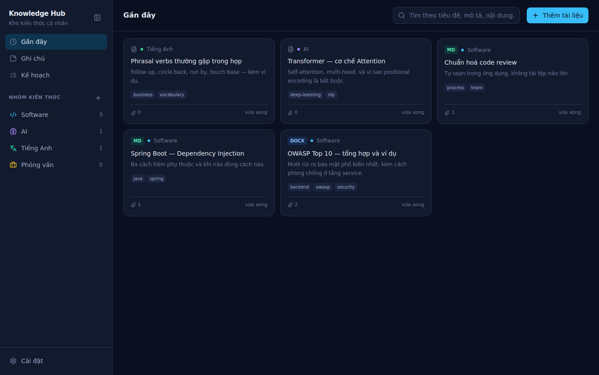

---

## Why it exists

Learning material accumulates as loose files: a PDF in Downloads, a `.docx` from a course, a
Markdown note in a folder you will not remember. Cloud note apps solve the organisation but ask
for a subscription, an account, and the willingness to hand over your material.

Knowledge Hub is the smaller answer. One window, one vault directory, a category tree you
control, and full-text search over what is inside the documents rather than only their names.
The files stay in ordinary folders you can open with a file manager; the application indexes
them rather than swallowing them.

---

## What it does today (v0.2)

| Capability | Detail |
|---|---|
| Categories | Create, colour, icon, rename; deletion refused while non-empty |
| Items | Title, summary, tags, one or more attached files |
| Upload | Native file dialog or drag-and-drop; PDF, `.docx`, Markdown, text, images |
| Write | Compose a Markdown or text document in the app, source beside a live preview — no file needed first |
| Edit content | Any stored Markdown or text file, including uploaded ones, editable in place |
| Edit details | An item's title, summary, tags and category, changeable after creation; moving it between categories moves it in the sidebar |
| Viewing | PDF and images inline, `.docx` converted to HTML, Markdown rendered, text verbatim |
| Notes | Written in the app: eight kinds, Markdown or plain text, optional deadline. Markdown notes edit as source beside a live review |
| Deadlines | A dated note sorts itself to the top; overdue is red, done sinks to the bottom |
| Checklists | A plan per day, or per body of work. Tasks with a state, a rank and an optional deadline; big tasks break into sub-tasks |
| Eisenhower | A module checklist ranks its tasks by the four quadrants and keeps them in that order; drag reorders within a quadrant, never across one |
| Progress | Percentage per plan over leaf tasks, plus a week/month dashboard with a bar per day |
| Search | Full text across titles, summaries, document contents and note bodies; diacritic-insensitive |
| Storage | SQLite index plus original files on disk, in a directory you choose |
| Appearance | Four themes (dark, light, sepia, high contrast); separate fonts for chrome, documents and source; window zoom and a content-only text scale, both remembered |
| Recovery | An `item.json` sidecar beside every item's files, and every note mirrored to a `.md`/`.txt` with front matter |
| Safety | Every destructive action confirms first, naming what it will destroy |
| Updates | Checks GitHub Releases once after launch and offers the new version. Nothing downloads or installs without a click |

Not yet: code signing (the installer warns "unknown publisher"), a log file, PDF text
extraction for search, sub-categories, notes in categories, recurring checklists, version
history for edited documents, renaming a stored file, export. See [docs/11-roadmap.md](docs/11-roadmap.md).

---

## Quick start

Requirements: Node.js 20 or newer, and a desktop session. On WSL that means WSLg, which is
present by default on Windows 11.

```bash
git clone <this repository> knowledge-hub
cd knowledge-hub
npm install                 # also rebuilds better-sqlite3 for Electron's ABI

cp .env.example .env        # optional, but read it — it is where the vault path lives
npm run dev                 # Next dev server + Electron window
```

The first run creates the vault and an empty database. Create a category in the left rail,
then use **Thêm tài liệu** to add your first document — or go to **Ghi chú** and write one
yourself. `Ctrl`+`B` collapses the rail when a document needs the width, and `Ctrl`+`+` /
`Ctrl`+`−` zoom the window if the default type size is too small — **Cài đặt → Giao diện** has
the theme, the fonts and a separate text scale for documents alone.

### Where your files go

In development the vault is `./data` inside the project. An **installed** copy puts it in the
running user's own application-data folder, so each person on a machine gets their own and no
configuration is needed — see [docs/13-distribution.md](docs/13-distribution.md).

**On this development machine, move it to the D: drive** — C: has roughly 15 GB free, D: has
212 GB, and the vault is the only part of this project that grows without bound:

```bash
# .env
KB_DATA_DIR=/mnt/d/KnowledgeHub
```

The application creates the directory on first run. Source code and `node_modules` stay on the
Linux filesystem, which is much faster than a `/mnt/*` mount. Full reasoning in
[docs/adr/0004-vault-location.md](docs/adr/0004-vault-location.md).

The **Nơi lưu trữ** screen always shows the resolved paths, so the answer to "where are my
files?" is one click away and never a guess.

---

## Commands

```bash
npm run dev          # development: Next dev server on :3100 + Electron
npm start            # run the production renderer from source, no installer
npm run build        # compile main process + static-export the renderer
npm run package      # build an installer into release/  (AppImage/deb, NSIS, dmg)

npm run typecheck    # both TypeScript projects
npm run smoke        # 186 end-to-end checks against a real database and real files
npm run shots        # boot the app, seed it, write screenshots to shots/
```

`npm run smoke` is the one to run before trusting a change. It exercises the real SQLite
schema, the real filesystem vault and the real `.docx` converter — no mocks — and takes a few
seconds. See [docs/12-testing.md](docs/12-testing.md).

---

## Screens

| | |
|---|---|
| 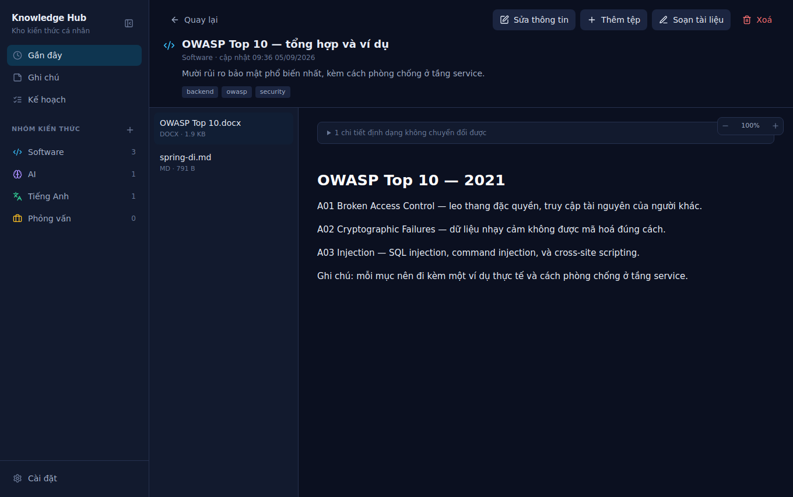 | 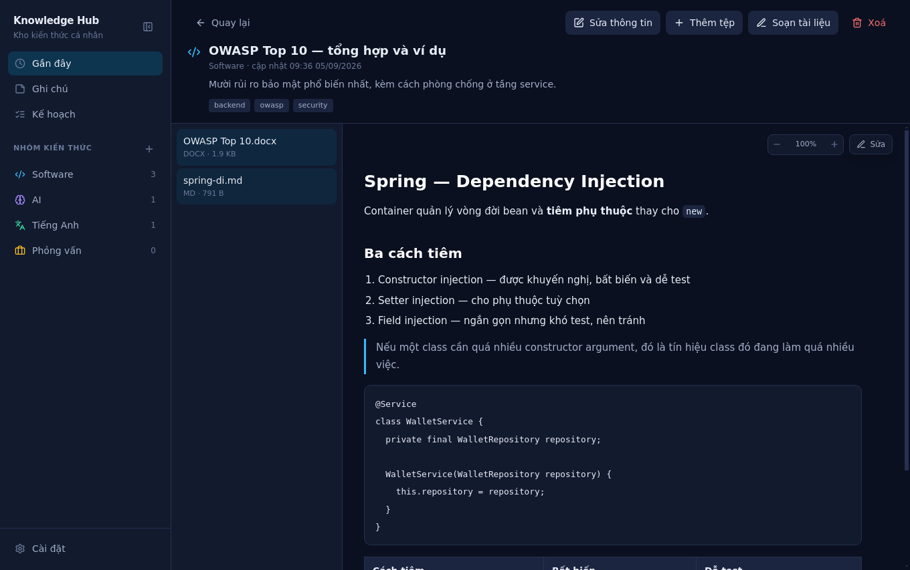 |
| A `.docx` converted to HTML | Markdown with code and tables |
| 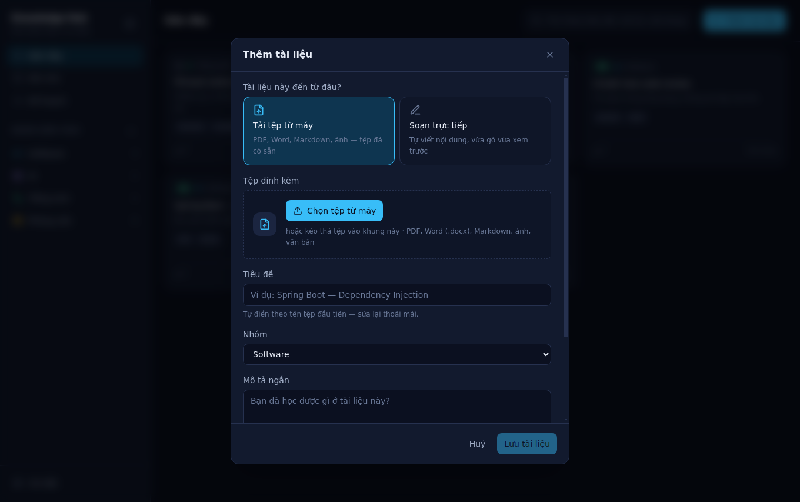 | 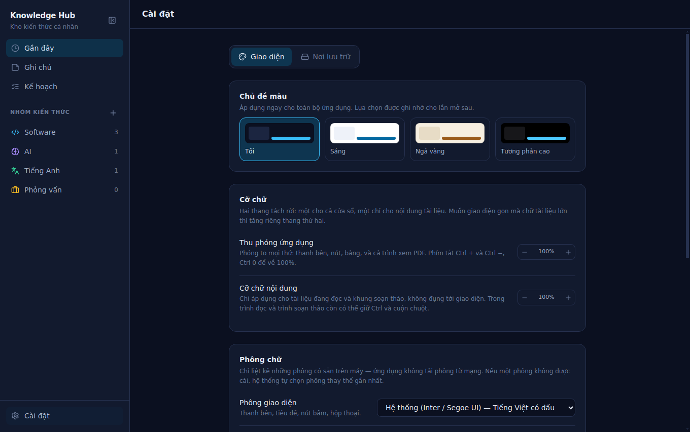 |
| Adding an item with attachments | Where the vault lives |
| 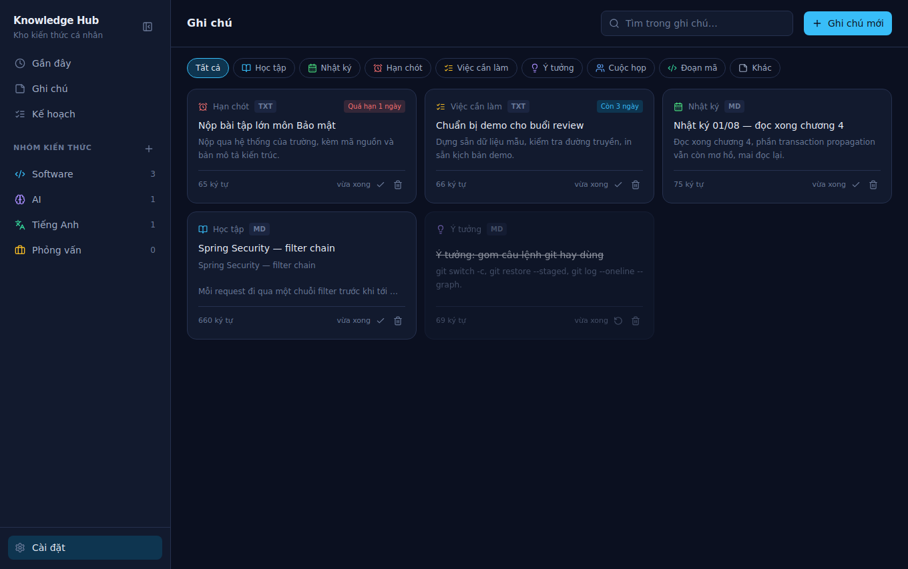 | 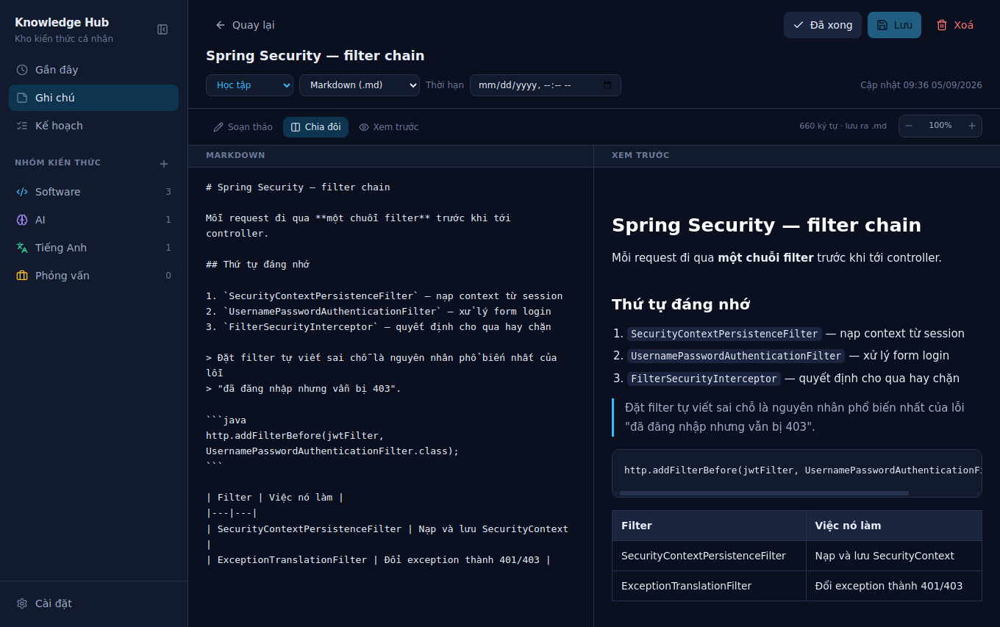 |
| Notes, deadlines first | Markdown source beside its live review |
| 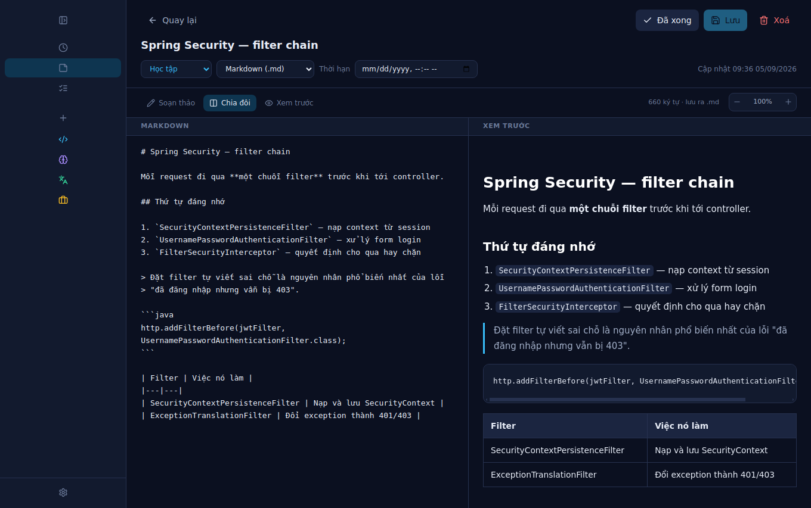 | 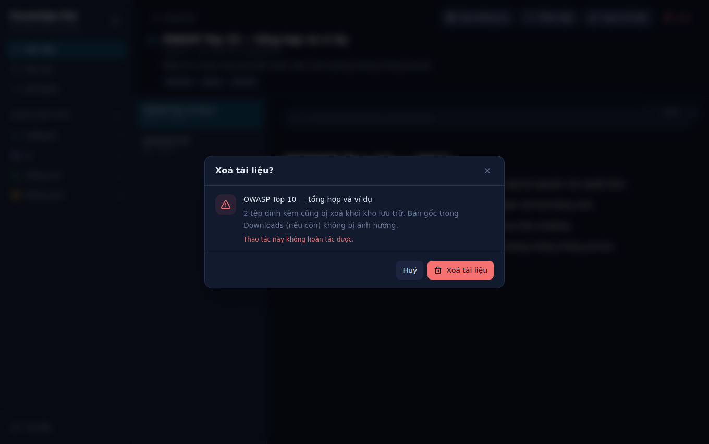 |
| The sidebar collapsed to an icon rail | Nothing is deleted on one click |
| 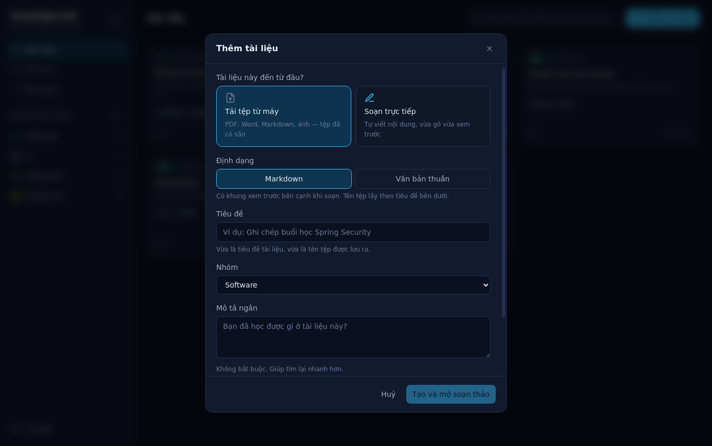 | 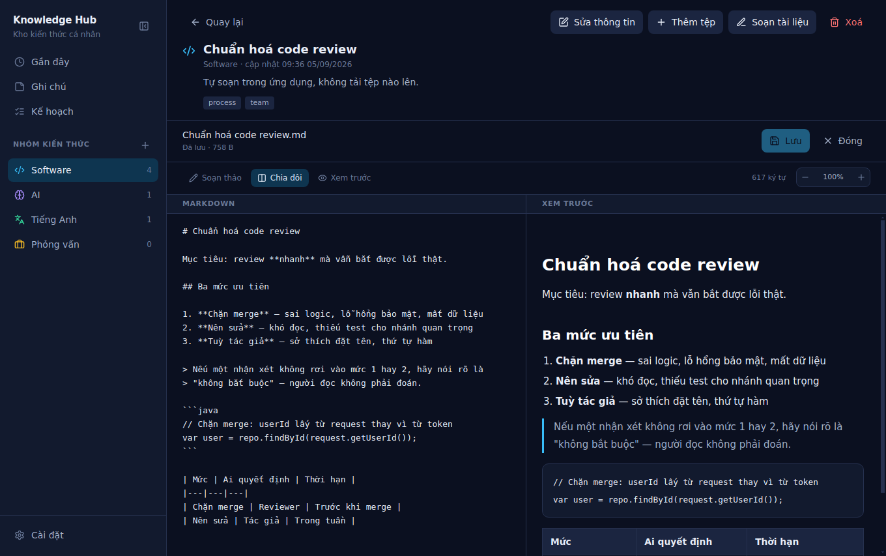 |
| Upload a file, or write one | Editing a stored `.md`, source beside review |
| 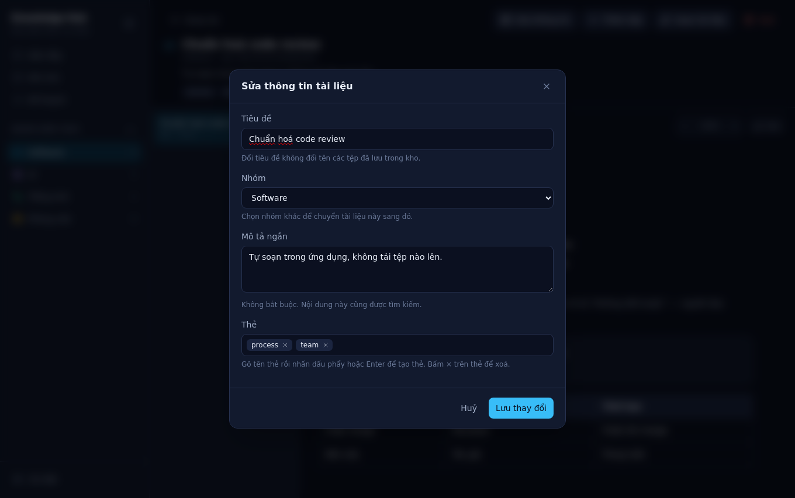 | 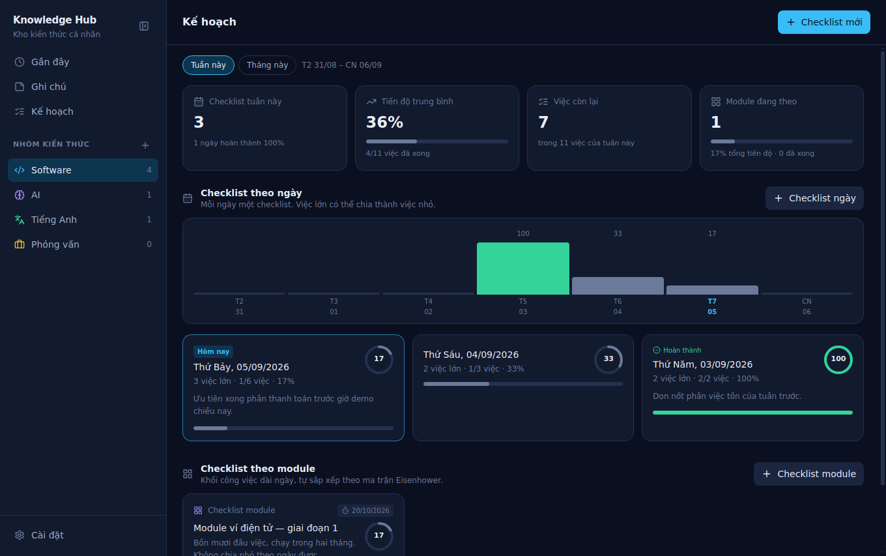 |
| Title, category, summary and tags, after the fact | Week tallies, a bar per day, both kinds of plan |
| 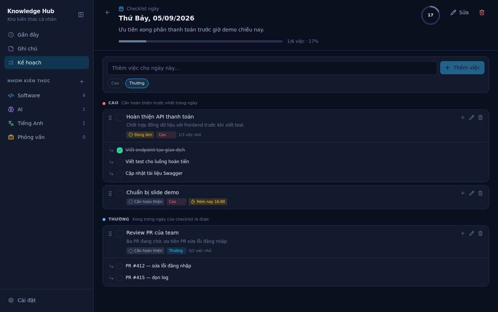 | 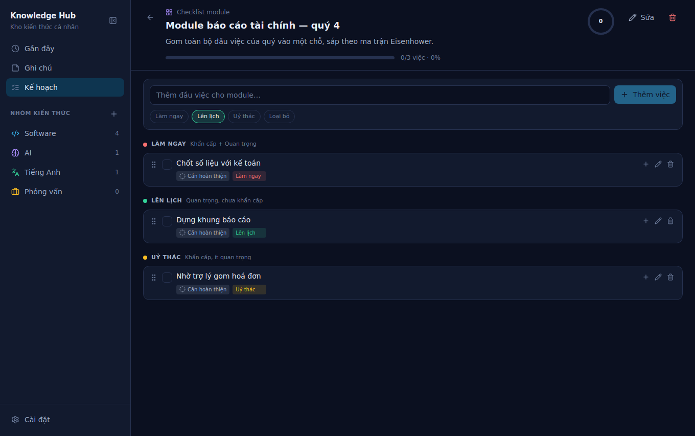 |
| A day's plan, with a big task broken down | A module plan, grouped by Eisenhower quadrant |
| 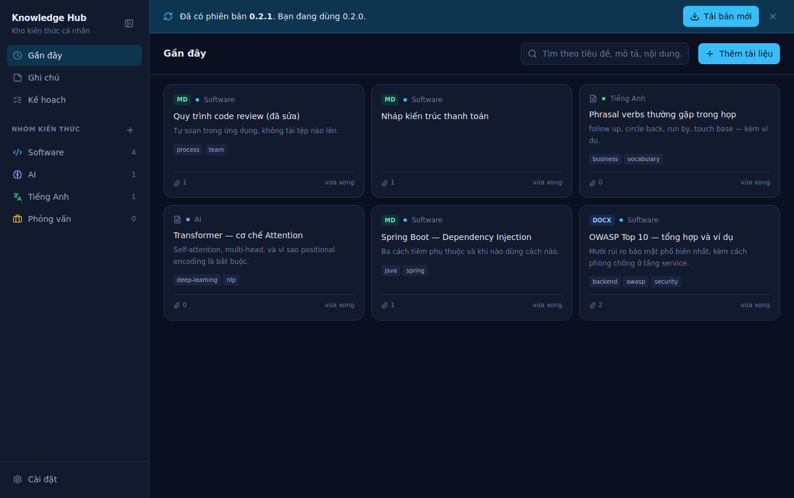 | |
| The only interruption the app allows itself | |

---

## Architecture in one paragraph

Electron with two processes. The **main process** owns everything real: SQLite, the filesystem
vault, document conversion. The **renderer** is a statically exported Next.js application with
no Node access at all — it talks to the main process over a typed IPC contract that plays the
role a REST API would play in a web app. Between them sits a preload bridge exposing a fixed
list of twenty-six IPC operations, plus two `webFrame` calls for window zoom that never reach the
main process at all, and nothing else. Inside the main process the layering is
conventional: IPC handlers are thin, services own the rules, repositories own the SQL, and
`src/core` defines the interfaces that keep those apart.

Read [docs/03-architecture.md](docs/03-architecture.md) for the real version.

---

## Documentation

Technical documentation is in English, matching the code identifiers. The end-user guide is in
Vietnamese. Start at [docs/README.md](docs/README.md).

| | |
|---|---|
| [01 Overview](docs/01-overview.md) | Problem, goals, non-goals, glossary |
| [02 Requirements](docs/02-requirements.md) | Functional and non-functional requirements |
| [03 Architecture](docs/03-architecture.md) | Processes, layers, and the rules between them |
| [04 Data model](docs/04-data-model.md) | Schema, invariants, migration policy |
| [05 IPC contract](docs/05-ipc-contract.md) | Every channel, payload and error code |
| [06 Storage layout](docs/06-storage-layout.md) | The vault on disk, backup, recovery |
| [07 Security](docs/07-security.md) | Threat model and Electron hardening |
| [08 UI guide](docs/08-ui-guide.md) | Screens, design tokens, element ids |
| [09 Development](docs/09-development.md) | Setup, scripts, build pipeline, debugging |
| [10 User guide](docs/10-user-guide.md) | Hướng dẫn sử dụng (tiếng Việt) |
| [11 Roadmap](docs/11-roadmap.md) | What comes next and what it would touch |
| [12 Testing](docs/12-testing.md) | Strategy and what the smoke test covers |
| [13 Distribution](docs/13-distribution.md) | Packaging, signing, updates, first-run for other people |
| [ADRs](docs/adr/README.md) | Why the significant decisions went the way they did |

---

## Licence

MIT. See [LICENSE](LICENSE).
