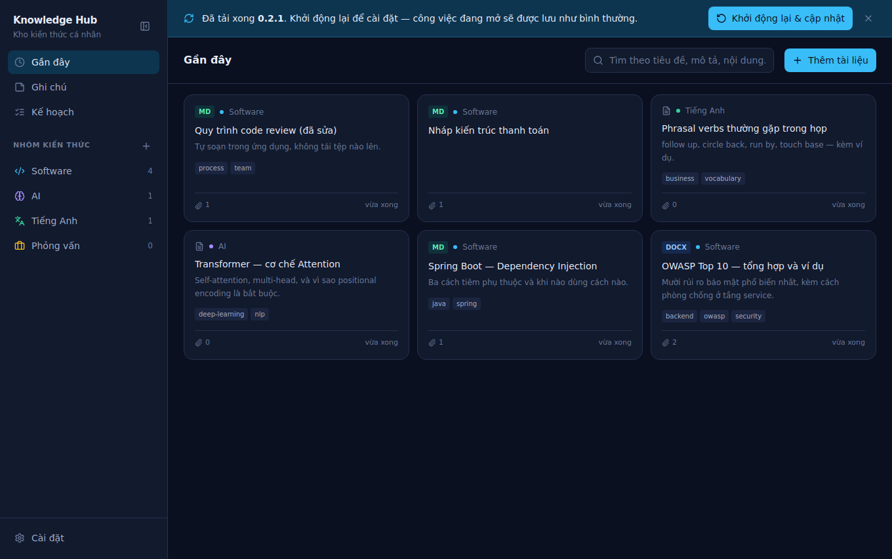
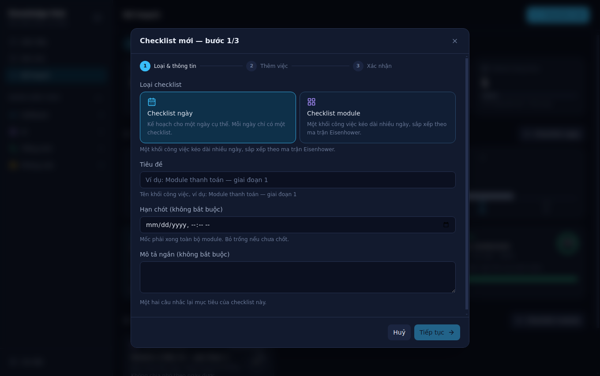
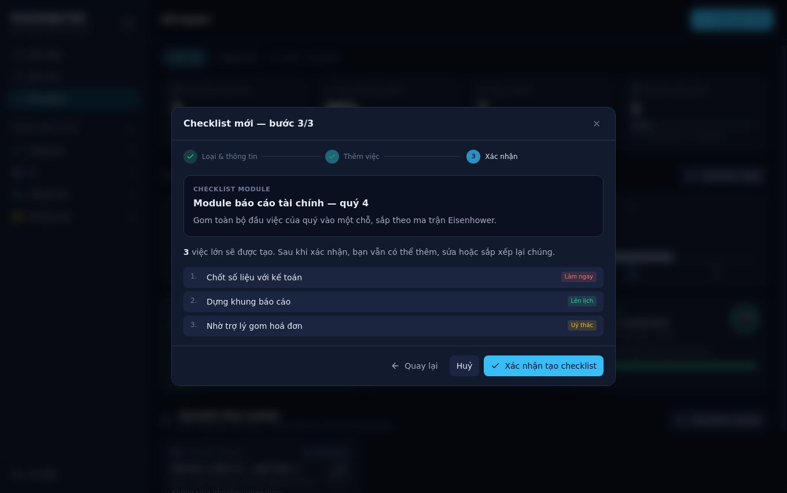
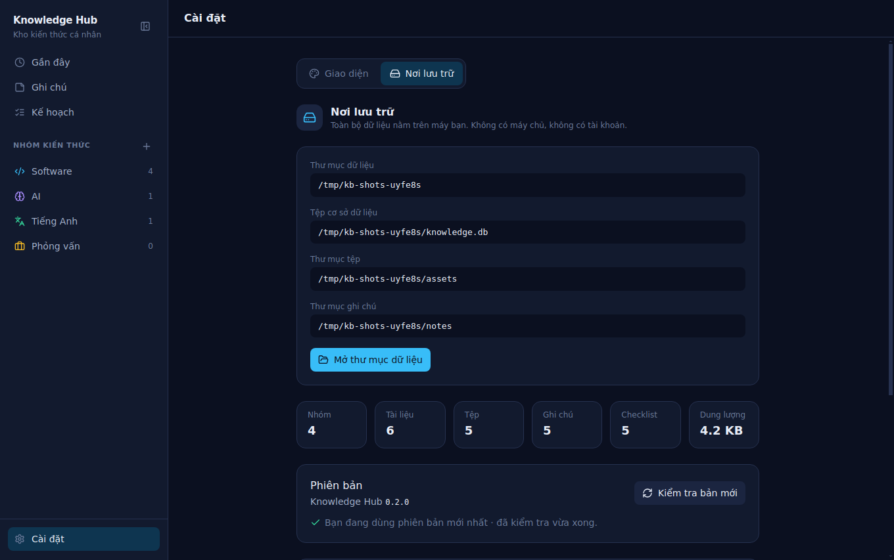

# 08 · UI guide

## Screens

Eight, all inside one window. There is no router: the store holds a `View` discriminated union
and the main pane switches on it. A static export with client-side view state avoids the
awkward corners of dynamic routes under a custom protocol, and nothing here benefits from a
back button.

```ts
type View =
  | { kind: 'recent' }
  | { kind: 'category'; categoryId: string }
  | { kind: 'search'; query: string }
  | { kind: 'notes' }
  | { kind: 'checklists' }
  | { kind: 'settings' }
```

| Screen | Component | What it is for |
|---|---|---|
| Recent / category list | `ItemGrid` | Cards, newest-updated first |
| Item detail | `ItemDetailPane` + `AssetViewer` | File list on the left, rendered document on the right |
| Document editor | `ItemDetailPane` + `AssetEditor` | Replaces the viewer; source beside its live review |
| Note list | `NoteGrid` | Cards, deadlines first; filter chips by kind |
| Note editor | `NoteEditorPane` | Metadata bar, then the Markdown source and its live review |
| Checklist dashboard | `ChecklistDashboard` | Week/month tallies, a bar per day, then the two kinds of plan |
| Checklist detail | `ChecklistDetailPane` | One plan: tasks grouped by rank, ticked and dragged in place |
| Settings | `SettingsPane` | Where the vault is, how big it is |
| Dialogs | `CategoryDialog`, `ItemDialog`, `NoteDialog`, `DocumentDialog`, `ChecklistDialog`, `ConfirmDialog` | Creation flows, and every destructive action |
| Update strip | `UpdateBanner` | Above every screen, but only in the three states that need a decision |

The detail view and the note editor **replace** the list rather than sitting beside it. A
three-column layout at 1360 px leaves none of the three columns usable, and documents need the
width more than the list does.

Note that `detail`, `note` and `checklist` are separate pieces of store state, and all three are
cleared whenever the view changes — so there is no arrangement in which two panes describe
different things.


---

## Layout

```
┌──────────────┬────────────────────────────────────────────────────┐
│ Sidebar      │ Header: heading · search · primary action          │
│ 256 / 56 px  ├────────────────────────────────────────────────────┤
│              │ Error banner (only when there is one)              │
│ Gần đây      ├────────────────────────────────────────────────────┤
│ Ghi chú      │                                                    │
│              │ Content — the only scrolling region                │
│ NHÓM         │                                                    │
│  Software  2 │                                                    │
│  AI        1 │                                                    │
│  Tiếng Anh 1 │                                                    │
│ ──────────── │                                                    │
│ Cài đặt      │                                                    │
└──────────────┴────────────────────────────────────────────────────┘
```

`body` has `overflow: hidden`. The window is the application, not a page — only the content
region scrolls.

### The collapsing sidebar

At 1360 px the expanded rail is nearly a fifth of the window, and a document or a two-section
Markdown editor wants all of it. `btn-toggle-sidebar` collapses it to a **56 px icon rail** —
and collapses rather than hides, because navigation still has to be one click away.

| | |
|---|---|
| Shortcut | `Ctrl`/`Cmd` + `B` |
| Persistence | `localStorage`, key `kb.sidebar.collapsed` |
| Collapsed | Icons only, each with its label as a native tooltip and `aria-label` |
| Element ids | Unchanged between the two widths, so no test depends on the rail's state |

The delete-category action is the one thing the collapsed rail drops: at 56 px there is no room
for it to be anything but a mis-click.


---

## Notes

A note is written here rather than uploaded, which makes it the only screen in the application
with a text field the user is expected to live in.

**Creation is split in two.** `NoteDialog` takes the metadata — title, kind, format, optional
deadline — and then hands over to the full-pane editor. A textarea in a modal is a worse place
to write than a pane, and a Markdown preview inside a modal would either be cramped or absent.

**A Markdown note has two sections, side by side**: the source on the left, the rendered review
on the right, updating as you type. The review uses the same `renderMarkdown` as the viewer for
a stored `.md` file, so what a note looks like while it is being written is what it looks like
afterwards — there is no second renderer to drift. `btn-note-editor-pane-source` /
`-split` / `-review` switch between them. A plain-text note gets one pane, because a preview of
unformatted text is the same text in a different font.

**Saving is explicit** (`btn-save-note`, or `Ctrl`/`Cmd` + `S`), and an unsaved draft says so
(`note-dirty`). Autosaving a body someone is still thinking about would write every half-formed
sentence into the vault.

**Deadlines sort themselves to the top.** Ordering comes from SQL — open-and-dated first by
`due_at`, then open-and-undated by recency, then everything ticked off — so it survives a
`LIMIT`. The due chip is red overdue, amber today or tomorrow, accent within a week, and a
plain date beyond that.


---

## Checklists

Two kinds of plan on one screen, because they answer the same question at two scales: *what am
I finishing today*, and *how far through this body of work am I*.


**The dashboard leads with the numbers.** Four tiles — plans in the window, average completion,
work remaining, module plans still running — then a bar per day, then the plans themselves. The
question this screen exists to answer is "how am I doing", and the lists below are the detail
behind the tiles rather than the other way round.

Every figure comes from `checklist:stats`. **Nothing on this screen re-tallies anything**: a
percentage the UI worked out for itself is a percentage that can disagree with the one on the
card beside it.

**Every day of the window gets a bar, including the empty ones.** A gap in the row is the most
useful thing the chart says, and a chart that only draws the days with a plan cannot say it. A
day with a plan and nothing done still gets a 4 % sliver, so "planned nothing" and "planned and
did nothing" look different — they are.

**The week/month switch does not touch the module half.** A two-month plan is relevant on every
day of those two months; hiding it when the window narrows would read as data loss.

### Creating one — three steps


Kind and metadata, then the tasks, then a confirmation. Three steps rather than one long form,
because the middle one is not a field — it is a list being assembled, and a list being
assembled needs somewhere to put each entry as it is finished.

**Nothing is written until the last step.** The plan and its tasks are created by a single IPC
call, so an abandoned wizard leaves nothing behind, and the "at least one task" rule is checked
against the whole thing rather than against a row that already exists.

The rank chips do **not** reset after each task is added. Someone entering four urgent tasks in
a row should not have to pick *Cao* four times.

### One plan, open


Tasks are drawn in groups, in the order the service already sorted them into. The component
never re-sorts: the ranking is a domain rule in `src/core/domain/checklist.ts`, and a second
copy of it in the renderer would be a second thing to keep in step.

**An empty group is drawn as nothing.** A matrix showing four headings with one task under them
reads as three failures.

**The tick and the status chip do different things.** The checkbox is *done / not done*; the
chip cycles *Cần hoàn thiện → Đang làm → Đã xong*, for the middle state a checkbox cannot
express.

**Ticking a big task carries its whole break-down.** The user asked for the big task to be
tickable; leaving three open sub-tasks under a finished parent would make the progress bar
disagree with the checkbox next to it. In the other direction a parent follows its children —
all done means done, any movement means *Đang làm*.

**Progress counts leaves.** Breaking one task into three sub-tasks must not make the day look
four tasks long, and a big task must not count as finished separately from the work that
finishes it.

### Dragging, and what it refuses

Reordering is drag-and-drop *within* a rank group. The gesture is refused at the **drop target**
rather than at the drag source: a task dragged towards a higher group simply finds nowhere to
land — no error, no dialog, and the matrix stays the thing that decides what comes first.

The group travels as a custom MIME type (`application/x-kb-group`) rather than as data read
during `dragover`. Browsers expose `dataTransfer.types` during a drag but not the values, by
design; putting the group in the *type* is what lets a row decide whether to offer itself as a
target at all.

Re-ranking is how a task changes group, and it lands at the end of the one it arrives in. Any
other position would be a guess, and the group it left has no memory of where it used to sit.


---

## Writing a document

A category used to hold only files that already existed. It now also holds documents written
here — and the same editor edits an uploaded `.md`, which turns out to be the half people use
most.

**One surface, two callers.** `TextComposer` is the source-beside-review pane, shared by the
note editor and the document editor. Two implementations of the same thing would drift into two
behaviours for the same keystrokes, and the review already has to agree with the viewer for a
stored `.md` — all three go through `renderMarkdown`.

**Creation is always metadata first, body second.** `ItemDialog` (new item) and `DocumentDialog`
(new document on an existing item) both take a name and a format, create the file empty, and
open the editor on it. A textarea inside a modal that scrolls is the worst place in the
application to write, and a Markdown preview in one is either cramped or missing.

**The source choice leads the dialog.** *Tải tệp từ máy* and *Soạn trực tiếp* are two cards of
equal weight at the top of `ItemDialog`, not a link under the dropzone — writing is not a
lesser way to add a document. Everything below the choice is identical between them, because
what gets created is the same item with the same kind of asset.

**Editing hides the file list.** Reading wants the list; writing wants the width. The editor's
own header names the open document and *Đóng* brings the list straight back.

**Saving is explicit** (`btn-save-asset`, or `Ctrl`/`Cmd` + `S`), `asset-editor-dirty` says when
there is something unsaved, and closing with unsaved work asks first
(`modal-confirm-discard-edit`) — the only confirmation in the application that protects
something not yet written rather than something about to be destroyed.

**The edit affordance floats over the document** rather than sitting in a toolbar. A permanent
bar would cost every reader vertical space to advertise an action most of them are not taking;
it stays visible rather than appearing on hover, because a control nobody knows about is not a
feature.


---

## The update strip


One strip across the top of the pane, above the header. It appears in exactly three states —
`available`, `downloading`, `downloaded` — and in no others.

**That restraint is the design.** A strip across someone's window is an interruption, and "you
are already up to date" does not earn one. `idle`, `checking`, `not-available`, `error` and
`unsupported` all report themselves in **Cài đặt → Nơi lưu trữ**, where the user went looking
for them.

**Dismissal lasts for the session only**, and is keyed to the version. Someone who does not want
to update today should not re-read the strip on every screen change; someone who dismissed
0.2.1 should still be told about 0.2.2.

The application never downloads or installs on its own, so this strip *is* the update
experience — every step after it appears is a click the user makes. The reasoning is in
[13-distribution.md](13-distribution.md#the-policy-and-why).



---

## Design tokens

Defined in `renderer/src/app/globals.css` under Tailwind v4's `@theme`, which means every token
is available as a utility (`bg-surface-1`, `text-ink-2`) and as a CSS variable.

| Token | Value | Used for |
|---|---|---|
| `--color-surface-0` | `#0b1020` | Application background, viewer background |
| `--color-surface-1` | `#121a2e` | Sidebar, panels, cards |
| `--color-surface-2` | `#1b2540` | Card hover, chips, code background |
| `--color-surface-3` | `#26314f` | Borders, dividers, scrollbar thumb |
| `--color-ink-1` | `#e8edf7` | Primary text |
| `--color-ink-2` | `#a3b0c9` | Secondary text |
| `--color-ink-3` | `#6b7a99` | Metadata, placeholders |
| `--color-accent` | `#38bdf8` | Primary action, focus ring, selection |
| `--color-accent-soft` | `#0e3550` | Selected row background |
| `--color-danger` | `#f87171` | Destructive actions, errors |
| `--color-success` | `#34d399` | Reserved |
| `--color-on-accent` | `#0b1020` | Label on a filled accent or danger button |

`--color-on-accent` exists because "text on a coloured button" and "the application background"
are not the same idea even when they are the same colour. Filled buttons used `text-surface-0`,
which is correct on the dark theme by coincidence and wrong on the light one.

### Typography and scale

Not `@theme` tokens — plain variables on `:root`, overwritten on `<html>` by the settings screen.

| Variable | Default | Applies to |
|---|---|---|
| `--ui-font` | `--font-stack-system` | Application chrome |
| `--doc-font` | `--font-stack-system` | `.doc-prose`, plain-text writing surface |
| `--mono-font` | `--font-stack-mono` | Markdown source, code, verbatim text. Also feeds Tailwind's `--font-mono`, so `font-mono` follows the setting |
| `--content-scale` | `1` | Multiplies type size in documents and editing panes |
| `--doc-heading` | `#ffffff` | Headings inside rendered documents |

The font families themselves are `--font-stack-*` variables in the same file, and that is the
only place they are written down: the settings screen and the pre-paint script both name a stack
(`var(--font-stack-segoe)`) rather than repeating a family list. Adding a font means adding a
stack there and a label in `TEXT_FONTS`/`MONO_FONTS`.

Only locally installed families are offered. The renderer's CSP permits no remote origin, so a
webfont would have to ship inside the bundle; every stack ends in a generic family instead.

### Themes

Four, chosen in **Cài đặt → Giao diện** and remembered in `localStorage`:

| `data-theme` | Name | For |
|---|---|---|
| *(absent)* / `dark` | Tối | Default. A dark shell makes the document the brightest thing on screen |
| `light` | Sáng | A bright room |
| `sepia` | Ngả vàng | Long reading; a paper-coloured surface |
| `contrast` | Tương phản cao | Maximum legibility — black ground, white text |

A theme is a block of variable overrides on `html[data-theme=…]`, which outranks `:root` on
specificity, so the dark values stay the fallback for any token a theme forgets. Tailwind v4
compiles `bg-surface-1` to `background-color: var(--color-surface-1)`, which is what makes this
work without a single component knowing that themes exist. **Adding a colour means adding a
token, never a literal** — a hardcoded hex is invisible until someone switches theme.

The choice is applied by a script in `<head>` before the first paint. Doing it in React instead
would mean reading `localStorage` during the first render, which disagrees with the prerendered
HTML the static export ships; deferring it to an effect repaints after paint, which is a visible
flash on every launch.

### Zoom

Two scales, deliberately separate:

| | Mechanism | Scales | Bound to |
|---|---|---|---|
| **Thu phóng ứng dụng** | Electron `webFrame.setZoomFactor` via the preload bridge | Everything, including the PDF viewer, images, and px sizes | `Ctrl` `+` / `Ctrl` `−` / `Ctrl` `0`, globally |
| **Cỡ chữ nội dung** | `--content-scale` | Documents and editing panes only | `−  %  +` in the viewer and editor toolbars, `Ctrl`+scroll over the content |

The application scale has to be Electron's own: no stylesheet in the renderer reaches inside the
`<iframe>` that Chromium's PDF viewer renders in. The content scale has to be CSS: enlarging a
document should not have to enlarge the sidebar with it.

`Ctrl` `+`/`−` is bound to the *application* scale rather than the content scale because it must
always do something visible — from a list screen, a content-only zoom would look broken.

### Category palette

Eight colours, assigned round-robin by `CategoryService` when the user does not pick one, so a
fresh vault looks organised without a decision being demanded up front. Same list in
`CategoryDialog`, so the preview matches the result.

```
#38bdf8  #a78bfa  #34d399  #fbbf24  #f472b6  #f87171  #60a5fa  #4ade80
```

---

## Element ids

**Every interactive element has a stable `id`.** These are the selectors any future automated
test uses, and `scripts/screenshot.ts` already depends on several of them — it throws rather
than producing a misleading screenshot if one is missing. Renaming an id is a breaking change
and updates this table in the same commit.

### Navigation

| id | Element |
|---|---|
| `sidebar` | The rail itself; `data-collapsed` is `true` or `false` |
| `btn-toggle-sidebar` | Collapse / expand. Also `Ctrl`+`B` |
| `nav-recent` | Recent view |
| `nav-notes` | Note list |
| `nav-checklists` | Checklist dashboard |
| `nav-category-{id}` | One category row |
| `nav-settings` | Settings |
| `btn-add-category` | `+` beside the category heading |
| `btn-delete-category-{id}` | Delete, shown on hover, only for an empty category, only when expanded |

### Header

| id | Element |
|---|---|
| `pane-heading` | Current screen title |
| `input-search` | Search box. Enter searches, Escape clears. Queries notes on the notes screen, items everywhere else |
| `btn-add-item` | Primary action on a list screen |
| `btn-add-note` | Primary action on the notes screen |
| `btn-add-checklist` | Primary action on the checklist screen. The search box is hidden there — there is nothing to search yet |

### Item list

| id | Element |
|---|---|
| `grid-items` | The grid container |
| `card-item-{id}` | One card |
| `empty-items` · `empty-search` | Empty states |
| `btn-add-item-empty` | Action inside the empty state |

### Item detail

| id | Element |
|---|---|
| `item-detail-title` | Title |
| `btn-back-to-list` | Back |
| `btn-edit-item-info` → `modal-item-info` | Edit the item's own fields |
| `btn-add-asset` · `btn-add-asset-empty` | Attach a file |
| `btn-compose-asset` · `btn-compose-asset-empty` | Write a new document into this item |
| `btn-edit-asset` | Floating *Sửa*, on a markdown or text viewer only |
| `btn-delete-item` → `modal-confirm-delete-item` | Delete, via the confirmation |
| `list-assets` | File list |
| `btn-select-asset-{id}` | Select a file |
| `btn-asset-external-{id}` · `btn-asset-reveal-{id}` · `btn-asset-delete-{id}` | Per-file actions |
| `viewer-pdf-{id}` · `viewer-image-{id}` · `viewer-doc-{id}` · `viewer-text-{id}` | Viewer, by kind |
| `viewer-warnings-{id}` | Collapsed conversion warnings |
| `empty-assets` | Item with no files |

### Category dialog

| id | Element |
|---|---|
| `modal-category` · `modal-category-close` | Dialog |
| `category-name` | Name input |
| `category-icon-picker` · `btn-icon-{Name}` | Icon picker |
| `category-color-picker` · `btn-color-{hex}` | Colour picker |
| `btn-submit-category` · `btn-cancel-category` | Actions |

### Item dialog

| id | Element |
|---|---|
| `modal-item` · `modal-item-close` | Dialog |
| `item-title` · `item-category` · `item-summary` · `item-tags` | Fields |
| `item-tags-chip-{n}` · `item-tags-chip-{n}-remove` | One committed tag, and its `×` |
| `item-source-picker` · `btn-source-upload` · `btn-source-compose` | Where the bytes come from |
| `item-format-picker` · `btn-item-format-{markdown\|text}` | Format, when composing |
| `item-files-dropzone` | Drop target, when uploading |
| `btn-pick-files` | Opens the native dialog |
| `list-picked-files` · `btn-remove-picked-{filename}` | Staged files |
| `btn-submit-item` · `btn-cancel-item` | Actions |
| `message-item-error` | Dialog-local error |

### Item info dialog

Editing what the item *is*, not what it holds. Separate from the item dialog because creation is
mostly about where the bytes come from, and none of that applies once the files are in the vault.

| id | Element |
|---|---|
| `modal-item-info` · `modal-item-info-close` | Dialog |
| `item-info-title` · `item-info-category` · `item-info-summary` · `item-info-tags` | Fields |
| `item-info-tags-chip-{n}` · `item-info-tags-chip-{n}-remove` | One committed tag, and its `×` |
| `btn-submit-item-info` · `btn-cancel-item-info` | Actions |

### Document dialog and editor

| id | Element |
|---|---|
| `modal-document` · `modal-document-close` | Dialog for a new document on an existing item |
| `document-name` · `document-format-picker` · `btn-document-format-{markdown\|text}` | Fields |
| `btn-submit-document` · `btn-cancel-document` | Actions |
| `doc-editor-source` · `doc-editor-review` | The two sections |
| `btn-doc-editor-pane-{source\|split\|review}` | Which section is on screen |
| `asset-editor-dirty` | Shown while there are unsaved changes |
| `btn-save-asset` · `btn-cancel-edit-asset` | Actions. Save is also `Ctrl`+`S` |
| `message-editor-error` | Shown when the document could not be loaded for editing |

### Note list

| id | Element |
|---|---|
| `grid-notes` | The grid container |
| `note-filters` · `btn-note-filter-all` · `btn-note-filter-{kind}` | Kind filter chips |
| `card-note-{id}` | One card |
| `btn-open-note-{id}` | Opens the editor |
| `btn-note-done-{id}` · `btn-note-delete-{id}` | Per-card actions |
| `empty-notes` · `btn-add-note-empty` | Empty state |

### Note dialog

| id | Element |
|---|---|
| `modal-note` · `modal-note-close` | Dialog |
| `note-title` · `note-due` · `btn-clear-note-due` | Fields |
| `note-kind-picker` · `btn-note-kind-{kind}` | Kind picker |
| `note-format-picker` · `btn-note-format-{markdown\|text}` | Format picker |
| `btn-submit-note` · `btn-cancel-note` | Actions |

### Note editor

| id | Element |
|---|---|
| `btn-back-to-notes` | Back to the list |
| `note-editor-title` | Title, edited in place |
| `note-editor-kind` · `note-editor-format` · `note-editor-due` · `btn-note-editor-clear-due` | Metadata bar |
| `note-editor-due-error` | Shown when a `deadline` note has no date, which is what blocks *Lưu* |
| `note-dirty` | Shown while there are unsaved changes |
| `btn-note-editor-pane-{source\|split\|review}` | Which section is on screen |
| `note-editor-source` | The Markdown / text area |
| `note-editor-review` | The rendered review |
| `btn-save-note` · `btn-note-toggle-done` · `btn-delete-note` | Actions |

### Checklist dashboard

| id | Element |
|---|---|
| `checklist-range` · `btn-checklist-range-{week\|month}` | The window switch |
| `checklist-stats` · `stat-checklist-count` · `stat-checklist-percent` · `stat-checklist-tasks` · `stat-module-progress` | The four tiles |
| `chart-checklist-range` · `bar-day-{YYYY-MM-DD}` | One bar per day; disabled when that day has no plan |
| `grid-daily-checklists` · `grid-module-checklists` | The two grids |
| `card-checklist-{id}` | One card, either kind |
| `btn-plan-today` | Shown only while today has no plan |
| `btn-add-daily-checklist` · `btn-add-module-checklist` | Section actions |
| `empty-daily-checklists` · `btn-add-daily-empty` · `empty-module-checklists` · `btn-add-module-empty` | Empty states |

### Checklist wizard

| id | Element |
|---|---|
| `modal-checklist` · `modal-checklist-close` | Dialog. The title carries the step: *bước 2/3* |
| `checklist-steps` | The step indicator |
| `checklist-kind-picker` · `btn-checklist-kind-{daily\|module}` | Kind picker |
| `checklist-day` | Date field, `daily` only |
| `checklist-title` · `checklist-due` · `btn-clear-checklist-due` | Fields, `module` only |
| `checklist-description` | Description, both kinds |
| `input-task-title` · `btn-add-task` | Adds one task to the draft list |
| `btn-task-priority-{high\|normal}` · `btn-task-quadrant-{do\|schedule\|delegate\|eliminate}` | Rank chips; which pair appears follows the kind |
| `btn-toggle-task-detail` · `input-task-description` · `input-task-due` | The optional half of a task |
| `list-draft-tasks` · `empty-draft-tasks` | The list being assembled |
| `btn-remove-draft-{key}` · `input-draft-child-{key}` · `btn-add-draft-child-{key}` · `btn-remove-draft-child-{key}` | Per-draft actions. `{key}` is a render key, not a stored id — nothing exists yet |
| `btn-checklist-back` · `btn-checklist-next` · `btn-submit-checklist` · `btn-cancel-checklist` | Navigation and the confirm |

### Checklist detail

| id | Element |
|---|---|
| `pane-checklist-{id}` | Container |
| `btn-close-checklist` | Back to the dashboard |
| `progress-checklist-{id}` | The header bar; `aria-valuenow` is the percentage |
| `btn-edit-checklist` · `btn-delete-checklist` | Header actions |
| `input-new-task` · `btn-submit-new-task` | Add a task to the open plan |
| `btn-new-task-priority-{high\|normal}` · `btn-new-task-quadrant-{quadrant}` | Rank for the task being added |
| `task-{id}` | One top-level row; it is the drag source *and* the drop target |
| `btn-task-done-{id}` · `btn-task-status-{id}` · `select-task-rank-{id}` | Tick, status cycle, re-rank |
| `btn-add-subtask-{id}` · `btn-edit-task-{id}` · `btn-delete-task-{id}` | Row actions |
| `input-subtask-{id}` · `input-subtask-{id}-submit` · `input-subtask-{id}-cancel` | The inline sub-task field |
| `btn-subtask-done-{id}` · `btn-edit-subtask-{id}` · `btn-delete-subtask-{id}` | Sub-task actions |
| `input-edit-task-{id}` · `input-edit-task-description-{id}` · `input-edit-task-due-{id}` · `btn-save-task-{id}` · `btn-cancel-task-{id}` | Inline editor |
| `modal-edit-checklist` · `edit-checklist-title` · `edit-checklist-due` · `edit-checklist-description` · `btn-save-checklist` · `btn-cancel-edit-checklist` | Metadata dialog |
| `modal-confirm-delete-checklist` · `modal-confirm-delete-task-{id}` | Confirmations |

### Settings

| id | Element |
|---|---|
| `pane-settings` | Container |
| `tab-settings-appearance` · `tab-settings-storage` | The two tabs |
| `btn-theme-dark` · `btn-theme-light` · `btn-theme-sepia` · `btn-theme-contrast` | Theme picker |
| `setting-ui-font` · `setting-doc-font` · `setting-mono-font` | Font selects |
| `btn-reset-appearance` | Back to every default |
| `settings-data-dir` · `settings-db-path` · `settings-assets-dir` · `settings-notes-dir` | Resolved paths |
| `stat-categories` · `stat-items` · `stat-assets` · `stat-notes` · `stat-checklists` · `stat-size` | Counts |
| `btn-open-vault-folder` | Opens the folder |

### Update strip and version

| id | Element |
|---|---|
| `banner-update` | The strip. Absent in every state that needs no decision |
| `btn-download-update` · `btn-install-update` · `btn-dismiss-update` | Its actions |
| `progress-update` | Download bar; `aria-valuenow` is the percentage |
| `settings-update` · `settings-version` · `settings-update-status` | The version block in **Nơi lưu trữ** |
| `btn-check-update` | Check on demand |
| `btn-download-update-settings` · `btn-install-update-settings` | The same two actions, from Settings |

### Zoom controls

One component, `ZoomControl`, in three places. Each instance exposes `<id>-out`, `<id>-value`
and `<id>-in`; the value is the reset button, not a label.

| id prefix | Where | Scale |
|---|---|---|
| `zoom-app` | Cài đặt → Giao diện | Application |
| `zoom-content` | Cài đặt → Giao diện | Content |
| `zoom-viewer` | Document viewer, floating top-right | Content |
| `zoom-composer` | Editor toolbar (documents and notes) | Content |

### Confirmation

One component, `ConfirmDialog`, behind every destructive action. Each caller passes its own ids
so a test can address the specific confirmation rather than "the dialog".

| id | Confirms |
|---|---|
| `modal-confirm-delete-item` · `btn-confirm-delete-item` · `btn-cancel-delete-item` | Deleting a document and its files |
| `modal-confirm-delete-asset` · `btn-confirm-delete-asset` · `btn-cancel-delete-asset` | Removing one file from a document |
| `modal-confirm-delete-category` · `btn-confirm-delete-category` · `btn-cancel-delete-category` | Deleting an empty category |
| `modal-confirm-delete-note` · `btn-confirm-delete-note` · `btn-cancel-delete-note` | Deleting a note and its file |
| `modal-confirm-discard-edit` · `btn-confirm-discard-edit` · `btn-cancel-discard-edit` | Closing the editor with unsaved changes |

### Global

| id | Element |
|---|---|
| `message-error` · `btn-dismiss-error` | Error banner |
| `notice-no-bridge` | Shown when opened in a plain browser |

---

## Conventions

### Language

Every string the user sees is Vietnamese. Every identifier, comment, error code and document is
English. No exceptions in either direction.

The consequence for errors: the main process returns a `code`, and
`renderer/src/lib/messages.ts` maps it to Vietnamese. The `message` field on the wire is for
the log. See [05-ipc-contract.md](05-ipc-contract.md#the-message-rule).

### Validation feedback

Shallow in the dialog — is the required field empty — and everything else from the service.
Duplicating length limits and uniqueness rules in the UI is how the two drift apart; the dialog
renders whatever code comes back.

Errors appear inline under the field when they belong to a field, and in a banner when they
belong to the operation.

### Destructive actions

**Every one of them goes through `ConfirmDialog`, and none of them happens on a single click.**

The first version had two behaviours and both were wrong. Deleting a *document* used an inline
two-step: pressing *Xoá* swapped the button for *Xoá hẳn* / *Huỷ*. The reasoning was that a
control changing shape under the cursor is harder to dismiss by reflex than a modal — but the
replacement button appears exactly where the cursor already is, so a second click lands on
*Xoá hẳn* before anything has been read. Deleting a *file* or an empty *category* had no
confirmation at all: one click on a small trash icon and the file was gone from the vault.

The confirmation that replaced both is a modal, and three properties are what make it work:

- **it names the thing.** Not "delete this item?" but the actual title, so a click on the wrong
  row is visible before it is irreversible
- **it says what else goes with it** — how many attached files, the note's copy in the vault —
  and states plainly that there is no undo
- **the confirm button is not where the button that opened it was**, so a double-click cannot
  carry through onto it

It is an in-app modal rather than `dialog.showMessageBox`: a native dialog steals focus from
the whole desktop and reads as something that happened *to* the user rather than something they
are doing. Escape and the backdrop both cancel; only `btn-confirm-*` proceeds.

Delete is still only offered for a category that is already empty, because the service would
refuse otherwise — an always-visible button that always errors is worse than no button.

### Empty states

Every list has one, and it says what to do next rather than that there is nothing. The
category-less case is different from the empty-category case, and the search-found-nothing case
is different again.

### Loading

A spinner with Vietnamese label text, not a skeleton. The operations here are fast and local;
a skeleton implies a layout that is about to appear, which is misleading when the answer may be
an empty state.

---

## Screens as built

| | |
|---|---|
|  |  |
| `.docx` converted by mammoth, styled by `.doc-prose` | Markdown with code, blockquote and table |
|  |  |
| Upload dialog, files staged as paths | Resolved vault paths and counts |
|  |  |
| Deadlines first, done notes last | Markdown source and its live review |
|  |  |
| The 56 px icon rail | The one confirmation, naming what it will destroy |
|  |  |
| Upload or write — two cards of equal weight | Editing a stored `.md`, full width |
|  |  |
| The item's own fields, opened prefilled | Tiles, then a bar per day, then the plans |
|  |  |
| Kind and metadata | What is about to be created, before anything is written |
|  |  |
| Grouped by Eisenhower quadrant; empty quadrants are not drawn | A big task with its break-down under it |
|  |  |
| The only interruption the app allows itself | The quiet states live here instead |

Regenerate with `npm run shots` after any visual change. The run drives the UI by element id
and throws when one is missing, so it doubles as a check on the tables above.

---

## `.doc-prose`

Rendered documents arrive as plain semantic HTML with no classes — mammoth emits `<h1>`,
`<p>`, `<table>`; marked does the same. So the document body is styled by element selector
under a single `.doc-prose` scope in `globals.css`, which keeps those bare-element rules from
leaking into the application chrome.

Measure is capped at `78ch`. Code blocks, tables and images each have their own treatment; the
table has visible borders because a Word table that loses its borders becomes unreadable.
