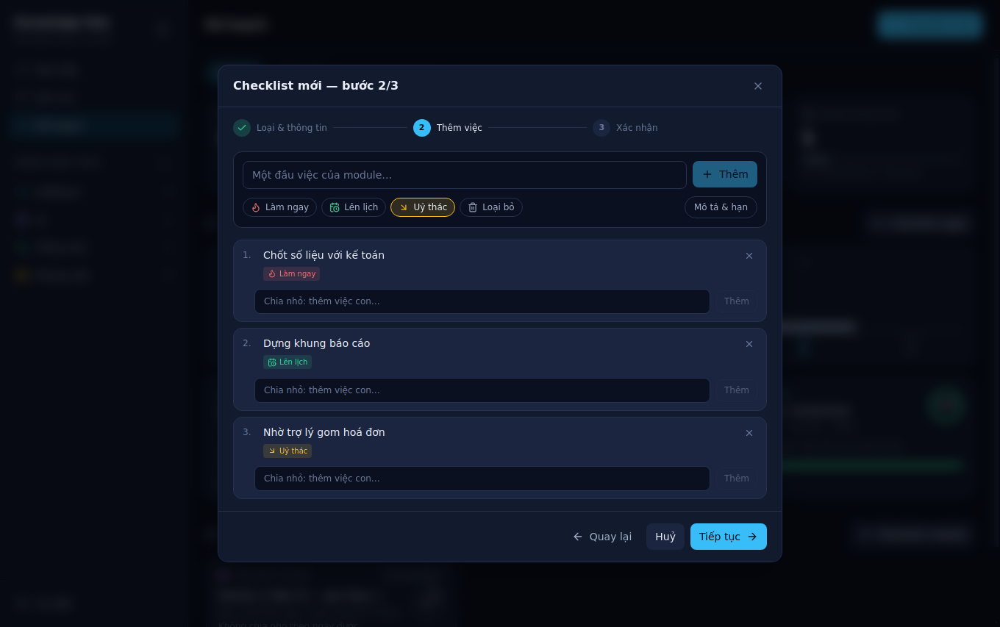

# 10 · Hướng dẫn sử dụng

> Đây là tài liệu duy nhất trong `docs/` viết bằng tiếng Việt, vì nó dành cho người dùng chứ
> không dành cho người sửa code. Các tài liệu kỹ thuật khác viết bằng tiếng Anh để khớp với
> tên biến, tên bảng và mã lỗi trong code.

---

## Knowledge Hub là gì

Một ứng dụng desktop để cất giữ mọi thứ bạn học: PDF, file Word, file Markdown — gom theo nhóm
do bạn tự đặt, và tìm được **theo nội dung bên trong tài liệu** chứ không chỉ theo tên file.
Ngoài ra bạn còn **tự viết ghi chú** ngay trong ứng dụng: bài học, nhật ký, hạn chót.

Ba loại nội dung, đừng nhầm:

| | **Tài liệu** | **Ghi chú** | **Checklist** |
|---|---|---|---|
| Là gì | Một mục trong nhóm kiến thức | Chữ bạn tự gõ, đứng riêng | Một kế hoạch có các việc tick được |
| Nội dung từ đâu | File bạn tải lên **hoặc** tự soạn ngay trong ứng dụng | Luôn tự gõ | Danh sách việc bạn tự lên |
| Nằm ở đâu | Trong một **nhóm kiến thức** | Ở màn **Ghi chú** riêng | Ở màn **Kế hoạch** riêng |
| Có gì kèm theo | Một hoặc nhiều file | Không có file đính kèm | Việc nhỏ bên trong việc lớn |
| Lưu ra đĩa thành | Đúng những file đó | Một file `.md` hoặc `.txt` | Chỉ nằm trong cơ sở dữ liệu |

> **Chọn cái nào?** Cần gom nhiều thứ quanh một chủ đề, có nhóm, có thẻ, có thể kèm PDF → dùng
> **tài liệu**. Ghi nhanh một ý, nhật ký hôm nay → dùng **ghi chú**. Cần lên lịch việc phải làm
> rồi theo dõi tiến độ phần trăm → dùng **checklist**.

Ba điều nên biết ngay:

- **Toàn bộ dữ liệu nằm trên máy bạn.** Không có máy chủ, không có tài khoản, không có gì được
  gửi đi đâu cả. Rút mạng vẫn dùng bình thường.
- **File gốc được giữ nguyên.** Ứng dụng *sao chép* file vào kho của nó, không di chuyển và
  không đổi định dạng. File trong Downloads của bạn vẫn còn nguyên ở đó.
- **Không bị khoá vào ứng dụng.** Kho lưu trữ chỉ là một thư mục bình thường. Mở bằng File
  Explorer vẫn thấy đúng các file đó, mở bằng Word vẫn đọc được. Ghi chú cũng vậy: mỗi ghi chú
  là một file `.md` hoặc `.txt` đọc được bằng bất kỳ trình soạn thảo nào.

---

## Khởi động lần đầu

```bash
cd /home/app/knowledge-hub
npm install
cp .env.example .env
npm run dev
```

Cửa sổ Knowledge Hub sẽ mở ra. Lần chạy đầu tiên tạo kho rỗng và cơ sở dữ liệu trống.

### Đặt kho lưu trữ ở ổ D

Khi chạy từ mã nguồn, kho nằm ở `data/` trong thư mục dự án. **Trên máy bạn nên chuyển sang ổ
D** — ổ C chỉ còn khoảng 15 GB, ổ D còn 212 GB, và kho tài liệu là thứ duy nhất sẽ phình to
theo thời gian.

> Nếu dùng **bản đã cài đặt** (file `.exe`), kho tự nằm trong thư mục dữ liệu riêng của tài
> khoản Windows đang đăng nhập — không cần cấu hình gì, và mỗi người dùng trên cùng một máy có
> kho riêng. Muốn đổi chỗ thì vẫn dùng `KB_DATA_DIR` như dưới đây, đặt file `.env` **cạnh file
> exe**. Chi tiết ở [13-distribution.md](13-distribution.md).

Mở file `.env` và bỏ dấu `#` ở dòng này:

```
KB_DATA_DIR=/mnt/d/KnowledgeHub
```

Khởi động lại ứng dụng. Thư mục sẽ được tạo tự động. Vào **Cài đặt → Nơi lưu trữ** để xác nhận đường
dẫn đã đổi đúng.

> Code và `node_modules` nên để nguyên trên ổ Linux — biên dịch ở đó nhanh hơn nhiều so với
> `/mnt/d`. Chỉ có kho tài liệu là nên nằm trên D.

---

## Tạo nhóm kiến thức

Nhóm là cách bạn chia kiến thức thành các mảng lớn: *Software*, *AI*, *Tiếng Anh*,
*Phỏng vấn*…

1. Bấm dấu **`+`** cạnh chữ **NHÓM KIẾN THỨC** ở thanh bên trái
2. Nhập tên nhóm
3. Chọn biểu tượng và màu (nếu bỏ qua, ứng dụng tự chọn giúp)
4. Bấm **Tạo nhóm**

**Lưu ý:**

- Tên nhóm không được trùng nhau, kể cả khác chữ hoa chữ thường — đã có `AI` thì không tạo
  được `ai`.
- Tên tối đa 60 ký tự.
- Tiếng Việt có dấu dùng thoải mái. Ứng dụng tự tạo mã không dấu ở phía sau
  (`Tiếng Anh` → `tieng-anh`).

---

## Thêm tài liệu

Bấm **Thêm tài liệu** ở góc trên bên phải. Câu hỏi đầu tiên là **tài liệu này đến từ đâu**, và
hai lựa chọn ngang hàng nhau:

### Cách 1 — Tải tệp từ máy


1. Chọn **Tải tệp từ máy**
2. Bấm **Chọn tệp từ máy** — hộp thoại chọn file của hệ điều hành sẽ mở ra, chọn được nhiều
   file cùng lúc. Hoặc kéo thả file thẳng vào khung.
3. **Tiêu đề** tự điền theo tên file đầu tiên. Sửa lại thoải mái — bắt buộc, tối đa 200 ký tự
4. Chọn **Nhóm**
5. **Mô tả ngắn** — không bắt buộc, nhưng nên viết: nó được tính vào kết quả tìm kiếm
6. **Thẻ** — gõ tên thẻ rồi nhấn **dấu phẩy** (hoặc **Enter**). Chữ vừa gõ biến thành một **thẻ
   rời** hiện ngay trong ô, kèm dấu **×** để xoá. Xem [Gắn thẻ](#gắn-thẻ) bên dưới
7. Bấm **Lưu tài liệu**

> File chỉ được **sao chép** vào kho khi anh bấm *Lưu tài liệu*. Bấm *Huỷ* thì không có gì
> được ghi ra đĩa cả.

### Cách 2 — Soạn trực tiếp


Không cần có file trước. Tự gõ nội dung ngay trong ứng dụng, vừa gõ vừa xem kết quả.

1. Chọn **Soạn trực tiếp**
2. Chọn **định dạng**: **Markdown** (có khung xem trước) hoặc **Văn bản thuần**
3. Nhập **tiêu đề** — đây cũng chính là tên tệp sẽ được lưu ra. Dòng gợi ý ngay bên trên cho
   biết tên tệp cuối cùng, ví dụ *"Sẽ lưu thành tệp Ghi chép buổi học.md trong kho."*
4. Chọn **Nhóm**, viết **mô tả** và **thẻ** như bình thường
5. Bấm **Tạo và mở soạn thảo**

Ứng dụng tạo tài liệu rỗng rồi mở thẳng khung soạn thảo. Xem phần
[Soạn và sửa nội dung](#soạn-và-sửa-nội-dung) bên dưới.

> Tài liệu bạn tự soạn được lưu thành **một file `.md` hoặc `.txt` thật** trong kho, nằm cùng
> chỗ với các file bạn tải lên. Mở bằng VS Code hay Obsidian đều đọc được. Ứng dụng không phân
> biệt file nào do bạn gõ, file nào do bạn tải lên — sau khi lưu thì chúng như nhau.

### Định dạng được hỗ trợ

| Định dạng | Xem trực tiếp trong ứng dụng | Tìm được theo nội dung |
|---|---|---|
| PDF | Có, có phóng to và lật trang | Chưa (chỉ tìm theo tiêu đề, mô tả, thẻ) |
| Word `.docx` | Có, giữ tiêu đề, danh sách, bảng, ảnh | Có |
| Markdown `.md` | Có, đầy đủ bảng và khối code | Có |
| Văn bản `.txt` `.csv` `.json` `.sql` `.java`… | Có | Có |
| Ảnh `.png` `.jpg` `.svg`… | Có | Không |
| Định dạng khác | Không — nhưng vẫn lưu, và mở được bằng ứng dụng ngoài | Không |

**Word `.doc` đời cũ không xem được trong ứng dụng** — chỉ `.docx` mới xem được. File `.doc`
vẫn được lưu an toàn, bấm *Mở bằng ứng dụng ngoài* để đọc bằng Word.

**Giới hạn:** mỗi file tối đa 200 MB. Một tài liệu có thể đính kèm nhiều file.

---

## Xem tài liệu

Bấm vào thẻ tài liệu bất kỳ.


Bên trái là danh sách file, bên phải là nội dung. Bấm sang file khác để đổi nội dung hiển thị.

Rê chuột lên một file trong danh sách sẽ hiện ba nút nhỏ:

| Nút | Tác dụng |
|---|---|
| ↗ | Mở bằng ứng dụng mặc định của hệ điều hành (Word, Acrobat…) |
| 📂 | Mở thư mục chứa file và chọn sẵn file đó |
| 🗑 | Xoá file này khỏi tài liệu |

Nếu file `.docx` có định dạng mà ứng dụng không chuyển đổi được, sẽ có một dòng thông báo thu
gọn ở đầu — bấm vào để xem chi tiết. Nội dung chữ vẫn hiển thị bình thường.

---

## Soạn và sửa nội dung


Với tài liệu Markdown, khung soạn thảo chia làm **hai phần**: bên trái là chỗ bạn gõ, bên phải
là kết quả sau khi định dạng, cập nhật ngay khi bạn gõ. Ba nút phía trên chuyển giữa
**Soạn thảo**, **Chia đôi** (mặc định) và **Xem trước**.

Cuộn khung bên trái thì khung bên phải cuộn theo, nên viết tới đâu nhìn thấy tới đó.

> **Phải bấm Lưu.** Ứng dụng không tự lưu — dòng *"Có thay đổi chưa lưu"* hiện lên khi bạn đã
> sửa mà chưa lưu. Bấm **Lưu** hoặc nhấn **Ctrl + S**. Nếu bấm **Đóng** khi còn thay đổi chưa
> lưu, ứng dụng sẽ hỏi lại trước.

Khi đang soạn, danh sách file bên trái tạm ẩn đi để nhường chỗ cho khung viết. Bấm **Đóng** là
nó hiện lại.

### Sửa tài liệu đã có

Mở tài liệu, chọn một file `.md` hoặc `.txt`, rồi bấm nút **Sửa** ở góc trên bên phải khung nội
dung.

**Việc này áp dụng cho cả file bạn đã tải lên**, không riêng file tự soạn. Một file `.md` kéo
từ Obsidian vào cũng sửa được ngay tại đây.

| Định dạng | Sửa được trong ứng dụng? |
|---|---|
| Markdown `.md` | Có |
| Văn bản `.txt` `.csv` `.json` `.sql` `.java`… | Có |
| Word `.docx` | Không — chỉ xem được. Sửa bằng Word rồi tải lại |
| PDF, ảnh | Không |

`.docx` cố tình không cho sửa: ứng dụng chỉ chuyển đổi được một chiều, ghi ngược lại sẽ làm mất
định dạng mà bạn không hề yêu cầu đụng tới.

### Thêm tài liệu soạn tay vào một mục đã có

Mở tài liệu → bấm **Soạn tài liệu** ở góc trên → nhập tên và chọn định dạng → **Tạo và mở soạn
thảo**. File mới nằm cạnh các file khác của mục đó.

> **Không có lịch sử phiên bản.** Bấm Lưu là ghi đè lên nội dung cũ, không hoàn tác được.

### Sửa thông tin tài liệu

Tiêu đề gõ vội lúc tạo, mô tả bỏ trống, thẻ đặt sai — sửa lại bất cứ lúc nào.

Mở tài liệu → bấm **Sửa thông tin** ở góc trên → đổi những gì cần đổi → **Lưu thay đổi**.

| Sửa được | Ghi chú |
|---|---|
| Tiêu đề | Bắt buộc, không được để trống |
| Nhóm | Chọn nhóm khác là tài liệu chuyển sang nhóm đó, số đếm ở thanh bên tự cập nhật |
| Mô tả ngắn | Để trống cũng được |
| Thẻ | Các thẻ hiện có đã nằm sẵn trong ô. Bấm **×** để bỏ một thẻ, gõ thêm rồi nhấn phẩy để thêm thẻ mới — xem [Gắn thẻ](#gắn-thẻ) |

Nội dung mới được đưa vào ô tìm kiếm ngay, nên tài liệu tìm thấy được bằng tiêu đề và mô tả mới.

---

### Gắn thẻ

Ô **Thẻ** không phải một dòng chữ — mỗi thẻ là một khối riêng, thấy được và xoá được từng cái.

**Tạo thẻ:** gõ tên thẻ, rồi nhấn **dấu phẩy** `,`. Chữ vừa gõ lập tức thành một thẻ. Nhấn
**Enter** hoặc **Tab** cũng vậy.

**Xoá thẻ:** bấm dấu **×** trên chính thẻ đó. Hoặc khi con trỏ đang ở ô trống, nhấn
**Backspace** để xoá thẻ ngay trước đó.

**Những điều nhỏ nhưng hay gặp:**

| Tình huống | Ứng dụng làm gì |
|---|---|
| Gõ một thẻ đã có | Không thêm trùng. Thẻ đã có sẽ **sáng lên một nhịp** để bạn thấy nó nằm ở đâu |
| Gõ `Spring` khi đã có `spring` | Coi như trùng — không phân biệt chữ hoa chữ thường |
| Gõ xong nhưng **quên** nhấn phẩy rồi bấm **Lưu** | Chữ đang gõ vẫn được tính thành thẻ, không bị mất |
| Dán cả `spring, di, backend` | Tách thành ba thẻ, không phải một thẻ dài |
| Chỉ gõ dấu cách rồi phẩy | Không tạo thẻ rỗng |

> Thẻ dùng chung cho toàn bộ kho, không riêng từng nhóm — `spring` trong *Software* và `spring`
> trong *Phỏng vấn* là cùng một thẻ. Đó là điểm mạnh của thẻ so với nhóm: nó cắt ngang cây nhóm.

> **Đổi tiêu đề không đổi tên file.** Các file đã lưu trong kho giữ nguyên tên và nguyên chỗ —
> sửa thông tin chỉ động vào phần mô tả của tài liệu, không động vào file. Muốn đổi tên một file
> thì hiện phải xoá file đó rồi tải lên lại.

---

## Ghi chú


Ghi chú là thứ **bạn tự viết**, không cần file đính kèm: tóm tắt bài học, nhật ký hằng ngày,
việc cần làm, hạn chót phải nhớ.

Bấm **Ghi chú** ở thanh bên trái để mở màn này.

### Tạo ghi chú mới

1. Bấm **Ghi chú mới** ở góc trên bên phải
2. Nhập **tiêu đề** — bắt buộc, tối đa 200 ký tự
3. Chọn **loại ghi chú** (xem bảng dưới)
4. Chọn **định dạng**:
   - **Markdown** — có tiêu đề, danh sách, bảng, khối code. Có khung xem trước. Lưu ra file `.md`
   - **Văn bản thuần** — chữ thô, gõ nhanh, không cần nhớ cú pháp. Lưu ra file `.txt`
5. Chọn **thời hạn** nếu cần
6. Bấm **Tạo và mở soạn thảo** — ứng dụng tạo ghi chú rồi mở luôn khung soạn thảo

### Tám loại ghi chú

| Loại | Dùng khi |
|---|---|
| **Học tập** | Tóm tắt bài học, kiến thức mới |
| **Nhật ký** | Ghi chép hằng ngày, hôm nay đã làm gì |
| **Hạn chót** | Có mốc thời gian bắt buộc — **loại này bắt buộc phải nhập thời hạn** |
| **Việc cần làm** | Danh sách việc, có thể đặt thời hạn hoặc không |
| **Ý tưởng** | Nghĩ ra được gì thì ghi lại ngay |
| **Cuộc họp** | Nội dung trao đổi và việc cần theo dõi sau đó |
| **Đoạn mã** | Câu lệnh, cấu hình, mẹo hay phải tra lại |
| **Khác** | Không thuộc nhóm nào ở trên |

Loại ghi chú chỉ để sắp xếp và lọc cho dễ tìm — không loại nào bị hạn chế tính năng gì.

### Soạn thảo: hai khung Markdown và Xem trước


Với ghi chú Markdown, màn soạn thảo chia làm **hai phần**:

- **Bên trái — Markdown**: chỗ bạn gõ, hiển thị đúng chữ thô bạn viết
- **Bên phải — Xem trước**: kết quả sau khi định dạng, cập nhật ngay khi bạn gõ

Ba nút phía trên chuyển giữa **Markdown** (chỉ khung gõ), **Chia đôi** (mặc định) và
**Xem trước** (chỉ khung kết quả).

Ghi chú văn bản thuần chỉ có một khung, vì không có gì để xem trước.

> **Phải bấm Lưu.** Ứng dụng không tự lưu — dòng *"Có thay đổi chưa lưu"* hiện lên khi bạn đã
> sửa mà chưa lưu. Bấm **Lưu** hoặc nhấn **Ctrl + S**.

Ngay trên khung gõ có thanh sửa nhanh: đổi tiêu đề, đổi loại, đổi định dạng, đặt hoặc bỏ thời
hạn. Đổi định dạng từ Markdown sang văn bản thuần (hoặc ngược lại) chỉ đổi cách hiển thị và
phần đuôi file — chữ bạn đã gõ giữ nguyên.

### Thời hạn và thứ tự hiển thị

Đây là điểm đáng nhớ nhất của màn ghi chú:

1. **Ghi chú có thời hạn luôn nằm trên đầu**, gần hạn nhất lên trước
2. Sau đó tới ghi chú không thời hạn, mới sửa gần đây nhất lên trước
3. **Ghi chú đã xong nằm cuối cùng**, chữ bị gạch ngang và làm mờ đi

Nhãn thời hạn đổi màu theo mức độ gấp:

| Màu | Nghĩa |
|---|---|
| 🔴 Đỏ | Đã quá hạn |
| 🟡 Vàng | Hôm nay hoặc ngày mai |
| 🔵 Xanh | Trong vòng một tuần |
| ⚪ Xám | Còn xa, hiện ngày cụ thể |

Bấm dấu **✓** trên thẻ ghi chú để đánh dấu đã xong. Bấm nút quay lại **↺** để mở lại.

### Lọc và tìm ghi chú

Hàng chip ngay dưới tiêu đề lọc theo loại — bấm **Tất cả** để bỏ lọc. Ô tìm kiếm ở góc trên,
khi đang ở màn Ghi chú, tìm trong **tiêu đề và nội dung ghi chú** (không tìm trong tài liệu).
Cũng không cần gõ dấu: `on tap` vẫn ra `Ôn tập`.

### Ghi chú nằm ở đâu trên đĩa

Mỗi ghi chú là một file thật trong thư mục `notes/` của kho lưu trữ, ví dụ:

```
notes/2026/08/5e8f2a71-…-Spring Security — filter chain.md
```

Đầu file có phần thông tin (tiêu đề, loại, thời hạn, thời điểm tạo và sửa), sau đó là nội dung
bạn gõ. Mở bằng Notepad, VS Code hay Obsidian đều đọc được bình thường.

Đổi tiêu đề hoặc đổi định dạng thì ứng dụng tự đổi tên file và **không để lại bản cũ**.

---

## Kế hoạch (Checklist)


Bấm **Kế hoạch** ở thanh bên trái. Màn này có hai phần, dùng cho hai kiểu công việc khác nhau:

| | **Checklist ngày** | **Checklist module** |
|---|---|---|
| Dùng khi | Lên việc cho **một ngày cụ thể** | Nhận **một khối công việc dài ngày** (ví dụ 40 đầu việc trong 2 tháng) |
| Tên gọi | Không có tiêu đề — **ngày chính là tên** | Bắt buộc có tiêu đề |
| Mỗi ngày | **Chỉ một checklist** | Không giới hạn |
| Xếp việc theo | **Cao** / **Thường** | **Ma trận Eisenhower** (4 ô) |
| Chia nhỏ việc | Có | Có |

### Bốn ô số liệu ở trên cùng

Chọn **Tuần này** hoặc **Tháng này** để đổi khoảng thống kê:

| Ô | Nghĩa |
|---|---|
| **Checklist tuần này** | Có bao nhiêu checklist ngày trong khoảng, và bao nhiêu ngày đạt 100% |
| **Tiến độ trung bình** | Phần trăm việc đã xong trên tổng số việc của khoảng |
| **Việc còn lại** | Số việc chưa xong |
| **Module đang theo** | Số checklist module chưa hoàn thành, kèm tổng tiến độ |

Biểu đồ cột bên dưới vẽ **mọi ngày trong khoảng**, kể cả ngày chưa có checklist — chỗ trống
trên biểu đồ chính là thứ đáng nhìn nhất. Bấm vào một cột để mở checklist của ngày đó.

> Checklist module **không bị lọc theo tuần/tháng**. Một kế hoạch kéo dài hai tháng thì ngày nào
> cũng liên quan, nên nó luôn hiện.

### Tạo checklist — ba bước



Bấm **Checklist mới** (hoặc **Lên kế hoạch hôm nay** khi hôm nay chưa có kế hoạch nào).

**Bước 1 — Loại & thông tin**

- Chọn **Checklist ngày** rồi chọn ngày; hoặc chọn **Checklist module** rồi nhập tiêu đề
- Nhập mô tả ngắn nếu muốn; checklist module có thêm ô **hạn chót**

**Bước 2 — Thêm việc**

1. Gõ tên việc vào ô trên cùng, bấm **Thêm** (hoặc nhấn `Enter`)
2. Trước khi bấm Thêm, chọn mức ưu tiên bằng hàng chip — mức đã chọn **được giữ nguyên** cho
   việc tiếp theo, không phải chọn lại từng lần
3. Cần mô tả hoặc hạn cho riêng việc đó thì bấm **Mô tả & hạn**
4. Muốn **chia nhỏ** một việc lớn: gõ vào ô *"Chia nhỏ: thêm việc con…"* ngay dưới việc đó

**Bước 3 — Xác nhận**

Xem lại toàn bộ rồi bấm **Xác nhận tạo checklist**. Trước lúc bấm nút này **chưa có gì được
lưu** — thoát giữa chừng không để lại gì cả.

> **Không tạo được checklist rỗng.** Phải có ít nhất một việc.
>
> **Không tạo được hai checklist cho cùng một ngày.** Muốn thêm việc cho ngày đó thì mở
> checklist của ngày đó ra và thêm vào.

### Bốn ô của ma trận Eisenhower

Dành cho checklist module. Việc tự động xếp theo đúng thứ tự này:

| Ô | Nghĩa | Làm gì |
|---|---|---|
| 🔴 **Làm ngay** | Khẩn cấp + Quan trọng | Xử lý trước tiên |
| 🟢 **Lên lịch** | Quan trọng, chưa khẩn cấp | Đặt lịch cụ thể, đừng để thành khẩn cấp |
| 🟡 **Uỷ thác** | Khẩn cấp, ít quan trọng | Nhờ người khác nếu được |
| ⚪ **Loại bỏ** | Không khẩn cấp, không quan trọng | Cân nhắc bỏ hẳn |

### Làm việc theo checklist


Bấm vào một thẻ để mở. Trong đó:

- **Ô vuông bên trái** — tick là xong, bấm lại là mở ra
- **Nhãn trạng thái** (*Cần hoàn thiện* → *Đang làm* → *Đã xong*) — bấm để chuyển vòng. Dùng nó
  khi việc đã bắt đầu nhưng chưa xong
- **Nhãn ưu tiên** — đổi mức ngay tại chỗ; việc sẽ tự nhảy sang nhóm mới
- **`+`** thêm việc nhỏ · **✏️** sửa tên/mô tả/hạn · **🗑️** xoá
- Ô trên cùng để **thêm việc mới** vào checklist đang mở

Vài quy tắc để không bị bất ngờ:

- **Tick việc lớn thì mọi việc nhỏ bên trong cũng được tick**, và bỏ tick cũng vậy
- **Xong hết việc nhỏ thì việc lớn tự thành *Đã xong*.** Mới xong một phần thì nó tự thành
  *Đang làm*
- **Phần trăm tính trên việc nhỏ nhất.** Chia một việc lớn thành ba việc nhỏ thì tổng là ba,
  không phải bốn — chia nhỏ không làm phồng con số
- **Không xoá được việc cuối cùng.** Muốn bỏ hết thì xoá cả checklist

### Kéo thả để đổi thứ tự

Kéo bằng biểu tượng ⣿ ở đầu mỗi dòng.

**Chỉ đổi được thứ tự giữa các việc cùng mức ưu tiên.** Kéo một việc *Thường* lên trên một việc
*Cao* thì nó không thả xuống được — ma trận quyết định thứ tự giữa các nhóm, bạn quyết định
thứ tự bên trong một nhóm. Muốn đưa một việc lên trên thật thì **đổi mức ưu tiên** của nó; việc
đó sẽ nhảy xuống cuối nhóm mới.

---

## Thu gọn thanh bên

Thanh bên trái chiếm 256 px — khá rộng khi bạn đang đọc một tài liệu hoặc gõ ghi chú.

Bấm nút ở góc trên thanh bên, hoặc nhấn **Ctrl + B**, để thu gọn nó thành một dải biểu tượng
rộng 56 px. Bấm lại để mở ra.


Khi đã thu gọn, các mục vẫn bấm được — rê chuột lên biểu tượng sẽ hiện tên. **Ứng dụng nhớ lựa
chọn này**, lần mở sau vẫn giữ nguyên trạng thái bạn để lại.

---

## Tìm kiếm

Gõ vào ô tìm kiếm ở góc trên rồi nhấn **Enter**. **Esc** để xoá và quay lại danh sách.

> Ô tìm kiếm tìm **theo màn hình đang mở**: ở màn Gần đây hoặc trong một nhóm thì tìm tài liệu,
> ở màn Ghi chú thì tìm ghi chú. Chuyển qua lại giữa hai bên sẽ xoá ô tìm kiếm, để bạn không
> nhìn nhầm kết quả cũ.

Tìm kiếm quét qua:

- tiêu đề tài liệu
- mô tả ngắn
- **nội dung bên trong** file Markdown, `.txt` và `.docx`

Vài điểm hữu ích:

- **Không cần gõ dấu.** Gõ `ghi chu` vẫn tìm ra `ghi chú`.
- **Từ cuối được tìm theo tiền tố.** Gõ `depend` đã ra `Dependency Injection`.
- **Nhiều từ = phải có đủ cả.** `spring bean` chỉ ra tài liệu chứa cả hai.
- **Ký tự lạ không gây lỗi.** Gõ nhầm dấu ngoặc kép cũng không sao.

Nội dung trong **PDF chưa tìm được** — đây là hạn chế đã biết, xem
[11-roadmap.md](11-roadmap.md).

---

## Sửa và xoá

### Không có gì bị xoá chỉ bằng một cú bấm


Mọi thao tác xoá — tài liệu, tệp đính kèm, nhóm kiến thức, ghi chú — đều mở một hộp thoại xác
nhận trước. Hộp thoại đó **gọi đúng tên thứ sắp bị xoá** và nói rõ những gì mất theo, để một cú
bấm nhầm hàng vẫn kịp nhận ra.

Nút xác nhận cố tình **không nằm ở chỗ nút bạn vừa bấm**, nên bấm đúp cũng không lỡ tay xác
nhận được. Nhấn **Esc** hoặc bấm ra ngoài để huỷ.

**Không thao tác xoá nào hoàn tác được.**

### Xoá một tài liệu

Mở tài liệu → bấm **Xoá** ở góc trên bên phải → hộp thoại hiện ra, cho biết có bao nhiêu tệp
đính kèm cũng sẽ mất → bấm **Xoá tài liệu**.

File gốc trong Downloads (nếu còn) thì không bị ảnh hưởng.

### Xoá một tệp trong tài liệu

Mở tài liệu → rê chuột lên tệp trong danh sách bên trái → bấm 🗑 → xác nhận.

Chỉ tệp đó bị xoá, các tệp khác của tài liệu vẫn còn.

### Xoá một ghi chú

Từ thẻ ghi chú bấm 🗑, hoặc mở ghi chú rồi bấm **Xoá** ở góc trên. Cả bản ghi lẫn file `.md`
/ `.txt` trong kho đều bị xoá.

### Xoá một nhóm

Chỉ xoá được nhóm **rỗng**. Nút xoá chỉ hiện khi rê chuột lên nhóm có số đếm bằng `0`, và chỉ
khi thanh bên đang mở rộng.

Đây là chủ ý: một cú bấm nhầm không được phép xoá cả một nhóm tài liệu bạn đã mất công gom.
Muốn xoá nhóm còn tài liệu, hãy xoá hết tài liệu bên trong trước.

### Thêm file vào tài liệu đã có

Mở tài liệu → bấm **Thêm tệp**.

---

## Cài đặt

Bấm **Cài đặt** ở cuối thanh bên trái. Màn này có hai tab: **Giao diện** để chọn ứng dụng trông
như thế nào, và **Nơi lưu trữ** để xem dữ liệu nằm ở đâu.

---

### Giao diện

Mọi thay đổi ở tab này **có hiệu lực ngay** — không có nút Lưu. Đổi thử, không thích thì đổi lại,
hoặc bấm **Đặt lại mặc định** để trả về ban đầu. Lựa chọn được ghi nhớ cho lần mở sau.

#### Chữ quá nhỏ, khó đọc

Đây là việc cần làm đầu tiên nếu chữ nhỏ. Có **hai thang riêng biệt**, vì chúng giải quyết hai
vấn đề khác nhau:

| | Phóng to cái gì | Dùng khi |
|---|---|---|
| **Thu phóng ứng dụng** | Toàn bộ cửa sổ: thanh bên, nút, bảng, **và cả trình xem PDF** | Mọi thứ đều nhỏ |
| **Cỡ chữ nội dung** | Chỉ tài liệu đang đọc và khung soạn thảo | Giao diện vừa rồi, chỉ chữ tài liệu nhỏ |

**Phím tắt cho thu phóng ứng dụng** — dùng được ở bất cứ đâu trong ứng dụng:

| Phím | Việc |
|---|---|
| `Ctrl` `+` | Phóng to |
| `Ctrl` `−` | Thu nhỏ |
| `Ctrl` `0` | Về 100% |

**Cỡ chữ nội dung** còn có nút ngay tại chỗ đang đọc: cụm `−  100%  +` ở góc trên bên phải khi
xem tài liệu, và trên thanh công cụ khi soạn thảo. Bấm vào **con số phần trăm** để đặt lại về
100%. Hoặc **giữ `Ctrl` và cuộn chuột** ngay trên nội dung.

> Trình xem PDF có thang thu phóng riêng của nó. Chỉ **Thu phóng ứng dụng** tác động được tới
> PDF — *Cỡ chữ nội dung* thì không.

#### Chủ đề màu

Bốn lựa chọn:

| Chủ đề | Phù hợp khi |
|---|---|
| **Tối** | Mặc định. Nền tối làm tài liệu thành thứ sáng nhất trên màn hình |
| **Sáng** | Phòng nhiều ánh sáng |
| **Ngả vàng** | Đọc tài liệu dài — màu giấy, dịu mắt |
| **Tương phản cao** | Cần dễ đọc nhất: nền đen tuyệt đối, chữ trắng |

#### Phông chữ

Ba lựa chọn, mỗi cái cho một vai trò khác nhau:

- **Phông giao diện** — thanh bên, tiêu đề, nút bấm, hộp thoại
- **Phông tài liệu** — nội dung Markdown và Word, ghi chú văn bản thuần. Phông **có chân**
  (Georgia, Times New Roman) thường dễ đọc hơn với tài liệu dài
- **Phông mã nguồn** — khung soạn Markdown, khối mã, tệp văn bản xem nguyên trạng

Danh sách chỉ gồm những phông **có sẵn trên máy** — ứng dụng không tải phông từ mạng. Nếu một
phông không được cài, hệ thống tự chọn phông thay thế gần nhất, nên không bao giờ mất chữ.

> Nếu dấu tiếng Việt trong khung soạn Markdown trông lệch hoặc rời ra, hãy đổi **Phông mã nguồn**
> sang `Consolas`. Không phải phông đẳng khoảng nào cũng dựng dấu tiếng Việt tốt.

Khung **Xem trước** ở dưới cùng hiện đúng ba vai trò đó với phông và cỡ chữ đang chọn, nên không
cần rời màn hình để biết kết quả.

---

### Nơi lưu trữ


Tab **Nơi lưu trữ** trả lời câu hỏi *"file của tôi nằm ở đâu?"* — luôn hiển thị đường dẫn thật,
không phải đường dẫn mặc định giả định.

- **Thư mục dữ liệu** — thư mục gốc của kho
- **Tệp cơ sở dữ liệu** — file chỉ mục `knowledge.db`
- **Thư mục tệp** — nơi chứa các file bạn đã tải lên
- **Thư mục ghi chú** — nơi chứa các file `.md` / `.txt` của ghi chú
- **Mở thư mục dữ liệu** — mở bằng trình quản lý file của hệ điều hành

Bên dưới là số nhóm, số tài liệu, số file, số ghi chú và tổng dung lượng.

---

## Sao lưu

**Sao chép thư mục dữ liệu là đã sao lưu đầy đủ** — cả chỉ mục lẫn file gốc.

```bash
# Đóng ứng dụng trước, để cơ sở dữ liệu được ghi xong hoàn toàn
rsync -a --delete /mnt/d/KnowledgeHub/ /mnt/d/Backups/KnowledgeHub-$(date +%F)/
```

Nếu không muốn đóng ứng dụng, sao lưu riêng cơ sở dữ liệu bằng lệnh an toàn:

```bash
sqlite3 /mnt/d/KnowledgeHub/knowledge.db ".backup '/tmp/knowledge-backup.db'"
```

Thư mục `assets/` thì sao chép lúc nào cũng được. Hầu hết file trong đó không bao giờ bị sửa
sau khi ghi; riêng tài liệu bạn tự soạn thì có, nhưng ứng dụng ghi ra file tạm rồi mới đổi tên
đè lên — nên bản sao chép luôn thấy một file trọn vẹn, hoặc bản cũ hoặc bản mới. Thư mục `notes/` thì có thể đang được ghi lại nếu bạn vừa sửa một ghi chú, nên vẫn nên
đóng ứng dụng trước cho chắc.

### Chuyển kho sang ổ khác

1. Đóng ứng dụng
2. Di chuyển cả thư mục sang vị trí mới
3. Sửa `KB_DATA_DIR` trong `.env`
4. Mở lại và kiểm tra ở **Cài đặt → Nơi lưu trữ**

Trong cơ sở dữ liệu không lưu đường dẫn tuyệt đối nào cả, nên đây chỉ là việc di chuyển thư
mục, không phải chuyển đổi dữ liệu.

---

## Khắc phục sự cố

| Hiện tượng | Nguyên nhân và cách xử lý |
|---|---|
| **Cửa sổ trắng trơn** | Renderer chưa build xong. Đóng và chạy lại `npm run dev`. |
| **"Giao diện này cần chạy trong ứng dụng"** | Bạn đang mở `localhost:3100` bằng trình duyệt. Đóng tab đó, dùng cửa sổ Knowledge Hub. |
| **"Không ghi được vào thư mục lưu trữ"** | `KB_DATA_DIR` trỏ vào chỗ không có quyền ghi, hoặc ổ đĩa chưa được gắn. Kiểm tra lại `.env`. |
| **"Tệp có trong danh mục nhưng không còn trên ổ đĩa"** | File đã bị xoá bên ngoài ứng dụng. Xoá file đó khỏi tài liệu để dọn dẹp. |
| **"Không hiển thị được nội dung tệp"** | Thường là file `.doc` cũ được đổi tên thành `.docx`. Bấm *Mở bằng ứng dụng ngoài*. |
| **"Nhóm vẫn còn tài liệu bên trong"** | Đúng như thiết kế. Xoá hoặc chuyển hết tài liệu trong nhóm trước. |
| **"Ghi chú loại Hạn chót cần có thời hạn cụ thể"** | Đúng như thiết kế. Nhập thời hạn, hoặc đổi sang loại *Việc cần làm* nếu chưa có mốc cụ thể. |
| **Gõ ghi chú xong thoát ra thì mất chữ** | Ghi chú không tự lưu. Bấm **Lưu** hoặc **Ctrl + S** trước khi rời khỏi. |
| **Không thấy nút Sửa trên tài liệu** | Chỉ file Markdown và văn bản mới sửa được trong ứng dụng. `.docx`, PDF và ảnh thì không. |
| **"Chỉ sửa được trực tiếp tệp Markdown và văn bản"** | Đúng như thiết kế. Mở bằng ứng dụng ngoài để sửa, rồi tải lại nếu cần. |
| **Thanh bên biến mất** | Bạn (hoặc **Ctrl + B**) đã thu gọn nó. Bấm nút ở góc trên dải biểu tượng để mở lại. |
| **"Tên nhóm này đã tồn tại"** | Không phân biệt hoa thường — đã có `AI` thì không tạo được `ai`. |
| **Lỗi `The module was compiled against a different Node.js version`** | Chạy `npx electron-builder install-app-deps`. |

Nếu gặp lỗi lạ, xem log ở cửa sổ terminal đang chạy `npm run dev`. Đặt `KB_LOG_LEVEL=debug`
trong `.env` để log chi tiết hơn.

---

## Những gì chưa có

Nói rõ để bạn không mất công đi tìm:

- Tìm kiếm bên trong **nội dung PDF**
- **Nhóm con** (nhóm lồng trong nhóm)
- **Sửa tiêu đề / mô tả / thẻ** của tài liệu đã tạo, từ giao diện (nội dung thì sửa được rồi)
- **Lịch sử phiên bản** — lưu là ghi đè, không xem lại được bản cũ
- **Xếp ghi chú vào nhóm** hoặc **gắn thẻ cho ghi chú** — ghi chú hiện đứng riêng
- **Nhắc nhở** khi tới hạn — thời hạn chỉ đẩy ghi chú lên đầu danh sách, không báo ra ngoài
- **Hoàn tác** sau khi xoá
- **Xuất dữ liệu** ra định dạng khác
- **Đồng bộ** giữa nhiều máy

Danh sách đầy đủ và thứ tự ưu tiên ở [11-roadmap.md](11-roadmap.md).
